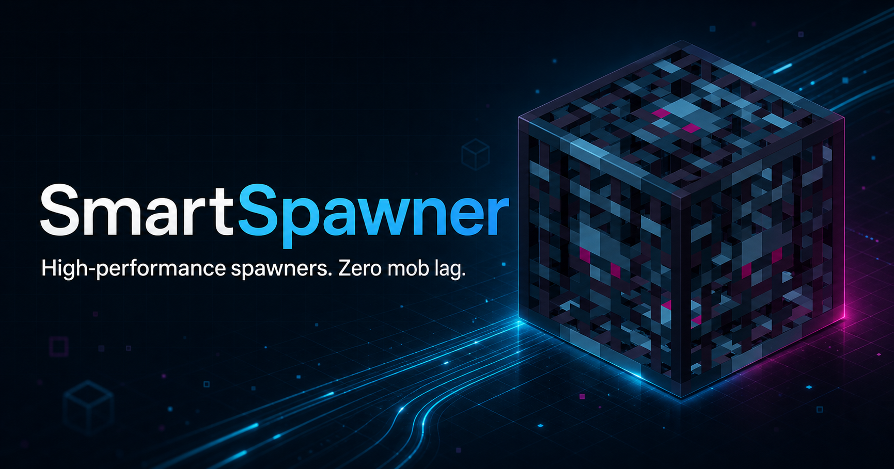

<div align="center">
  


[](https://modrinth.com/plugin/smartspawner)
[](https://www.spigotmc.org/resources/120743/)
[](https://hangar.papermc.io/Nighter/SmartSpawner)

[](https://docs.smartspawner.site/)
[](http://discord.com/invite/FJN7hJKPyb)

</div>

## Requirements

- **Minecraft Version:** 1.21.5 - 26.2
- **Server Software:** Paper, Folia or compatible forks
- **Java Version:** 25+

## Localization

| Language           | Locale Code | Contributor                                     | Status |
|--------------------|-------------|-------------------------------------------------|--------|
| 🇨🇳 Chinese Simplified | `zh_CN`     | [SnowCutieOwO](https://github.com/SnowCutieOwO) | v1.2.3 (Outdated) |
| 🇩🇪 German             | `de_DE`     | [jannispkz](https://github.com/jannispkz)       | v1.6.7 (Outdated) |
| 🇺🇸 English            | `en_US`     | [Nighter](https://github.com/ptthanh02)         | Latest |
| 🇮🇹 Italian            | `it_IT`     | [RV_SkeLe](https://github.com/RVSkeLe)          | v1.3.5 (Outdated) |
| 🇹🇷 Turkish            | `tr_TR`     | berkkorkmaz, [onurrrk](https://github.com/onurrrk) | Latest |
| 🇻🇳 Vietnamese         | `vi_VN`     | [Nighter](https://github.com/ptthanh02)         | Latest |

## API

For developers interested in integrating with SmartSpawner, visit the [Developer API Documentation](https://docs.smartspawner.site/developer-api/).

## Building

```bash
git clone https://github.com/OpenVdra/SmartSpawner.git
cd SmartSpawner
./gradlew :core:shadowJar
```

On Windows, use `gradlew.bat :core:shadowJar`. The compiled plugin JAR will be available in `core/build/libs/` as `SmartSpawner-<version>.jar`.

## Support

- **Issues & Bug Reports:** [GitHub Issues](https://github.com/OpenVdra/smartspawner/issues)
- **Discord Community:** [Join our Discord](https://dsc.gg/openvdra)

## Statistics

[](https://bstats.org/plugin/bukkit/SmartSpawner)

## License

This project is licensed under the GPLv3 License - see the [LICENSE](LICENSE) file for details.
